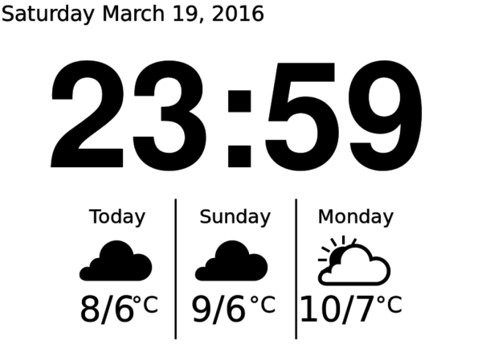

# Kindle Time and Weather

Similar to [Kindle Weather Display](http://www.mpetroff.net/archives/2012/09/14/kindle-weather-display/), but with time and Docker.

## Server side

In the server directory, build the image

    sudo docker build -t kindleweather .

Create running container

    sudo docker-compose up -d

Wait a minute or so, and the image should become available at port 9000 - http://mendhak.com:9000/weather-script-output.png

You can change the port in the `docker-compose.yml`

## Kindle side

Ensure the Kindle is jailbroken with USBNet.  Modify `weather-script.sh` to point to the correct image URL.

Copy the script files over to the Kindle:

    scp -r kindle/* root@192.168.1.72:/mnt/us/weather

SSH into the Kindle, and create a cron job for on boot by running

    /mnt/us/weather/utils/setupcrons.sh
    reboot

The reboot is necessary for the new cron task to take effect.

## Original

This is a fork of a fork of a fork of a fork with several modifications for time over weather.

Base script from:
http://www.mpetroff.net/archives/2012/09/14/kindle-weather-display/
